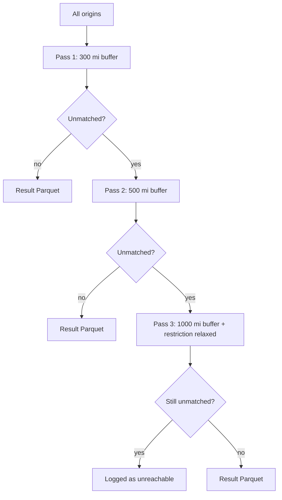

# Adaptive OD Cost Matrix

Network travel-time and distance computation from origin block groups to NAICS-coded points of interest (POIs), using ArcGIS Network Analyst (`arcpy.nax`) with an adaptive three-pass buffering strategy.

This repository accompanies *[TBD]* and is provided so that the travel-time computation underlying the analysis is fully transparent and reproducible. It is a methods reference, not a turnkey tool: running it requires a licensed ArcGIS Pro environment and licensed input data (see [Requirements](#requirements) and [Data availability](#data-availability)).

## Overview

For a large set of origins (e.g., U.S. census block group centroids), the pipeline finds, for each origin, the network travel time and distance to nearby destinations of a given NAICS code. A single national OD solve is often computationally infeasible, so origins are processed in **county-grouped chunks**, and for each chunk, the candidate destinations are restricted to those within a buffer around the chunk's mean origin location before solving.

Because some origins are remote and may find no destination within the standard buffer, the pipeline runs up to three passes with progressively wider buffers and, in the final pass, relaxed routing constraints. Only origins still unmatched after a pass are carried forward to the next one.

| Pass | Buffer | Changes | Applied to |
|------|--------|---------|------------|
| 1 | 300 mi | Standard travel mode | All origins |
| 2 | 500 mi | Standard travel mode | Origins unmatched after Pass 1 |
| 3 | 1000 mi | `Driving an Automobile` restriction removed; hierarchy disabled | Origins unmatched after Pass 2 |



### Key design choices

- **County-grouped chunking.** Origins are grouped by the first five characters of their ID (the county FIPS prefix) and split into chunks of `chunk_size`. Chunks are solved in parallel across worker processes.
- **Mean-point buffer pre-selection.** For each chunk, a buffer is drawn around the mean coordinate of its origins, and only destinations intersecting that buffer are loaded into the solve. This bounds the size of each OD problem.
- **Checkpointing / resumability.** Each chunk writes its own Parquet file. On restart, chunks whose output already exists are skipped, so an interrupted run resumes where it left off.
- **Three-pass fallback.** Widening the buffer (and finally dropping the automobile restriction and network hierarchy) ensures even remote origins are given a chance to reach a destination, while keeping the common case cheap.

## Requirements

- **ArcGIS Pro** with the **Network Analyst** extension, and its bundled Python environment (`arcgispro-py3`). `arcpy` is not available via `pip`; it ships with ArcGIS Pro.
- **A routing network dataset.** Developed against Esri **StreetMap Premium** (North America routing FGDB). Any compatible network dataset with a `Driving Time` travel mode should work after adjusting the config.
- Python packages: `pandas`, `pyarrow` (Parquet I/O), `pyyaml` (config). These are typically already present in the ArcGIS Pro conda environment; see [`requirements.txt`](requirements.txt).

## Data availability

The code in this repository is openly shared. The input datasets are **not** redistributed here, as they are either licensed or must be obtained separately:

- **Routing network** — Esri StreetMap Premium is a licensed product and is not included. Obtain it through your Esri licensing.
- **Destinations** — POI feature classes (`poi_advan_<naics_code>`) are derived from a licensed commercial POI dataset from Advan Research via Dewey and are not redistributed. Equivalent POI data with a `Name` ID field can be substituted.
- **Origins** — `origins_bg` is a point feature class of origin locations with a `Name` field carrying an ID whose first five characters are the county FIPS code (e.g., census block-group GEOIDs). Public TIGER/Line geography can be used to construct an equivalent layer.

## Repository structure

```
.
├── od_cost_matrix_three_pass.py   # main pipeline
├── config.example.yaml            # configuration template (copy to config.yaml)
├── requirements.txt               # Python dependencies (beyond arcpy)
├── README.md
└── LICENSE
```

## Configuration

All machine- and run-specific settings are read from a YAML file; no paths are hard-coded in the script.

```bash
cp config.example.yaml config.yaml
# then edit config.yaml: set naics_code, src_gdb, network_dataset, etc.
```

The script reads `config.yaml` from the working directory by default. To use a different path, set the `OD_CONFIG` environment variable.

## Usage

From the ArcGIS Pro Python environment, with `config.yaml` in place:

```bash
python od_cost_matrix_three_pass.py
```

The run prints per-chunk progress and a final summary, and appends a row to `nax_summary.md` recording origin counts, unmatched counts per pass, and elapsed time.

## Output

Each chunk produces a Parquet file named `od_<county>_<seq>.parquet` in the pass's output directory, with the following columns:

| Column | Description |
|--------|-------------|
| `OriginName` | Origin ID |
| `DestinationName` | Destination (POI) ID |
| `Total_Time_Min` | Network travel time, minutes (`float32`) |
| `Total_Distance_km` | Network distance, kilometers (`float32`) |

Origins that still have no reachable destination after Pass 3 are written to `unmatched_origins_<naics_code>_pass3_final.txt`.

## Citation

If you use this code, please cite:

> Kim, K., DeJohn, A., and Kan, W. (2026). Adaptive OD Cost Matrix (version 1.0.0). Zenodo. https://doi.org/10.5281/zenodo.20789862

## License

See [LICENSE](LICENSE).
